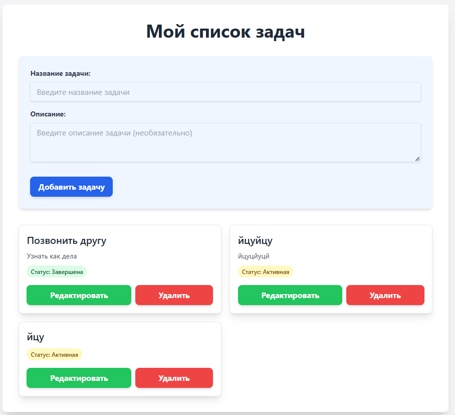
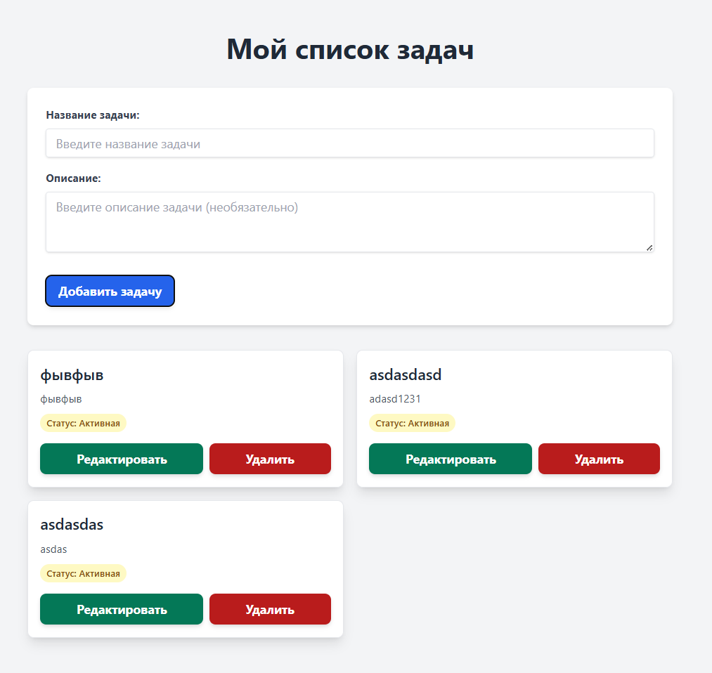
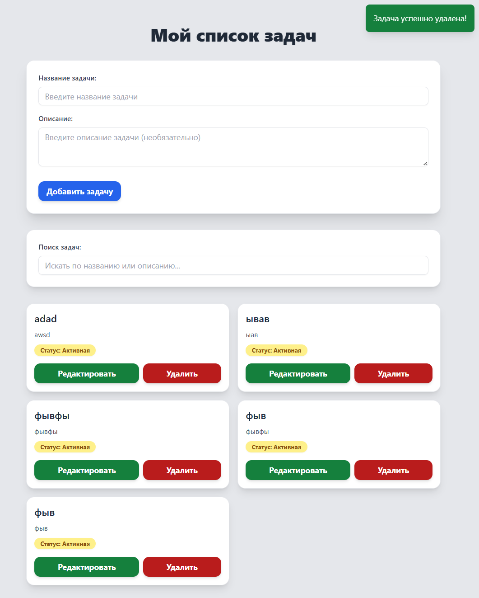

# Список задач

## Ход работы

Для начала, я составлю грамотный промпт. Для этого, закину весь текст ТЗ и попрошу AI рассказать что он понял. 

```
Хорошо. Я хочу создать веб-приложение список. Напиши промпт для дальнейшей генерации
```

Далее, уточню детали
```
Добавь в этот промпт: добавление, удаление и редактирование записей
```
Ещё чуть-чуть
```
Добавь в этот промпт: адаптивную верстку и работу с indexdb
```
Ну и финал
```
А теперь сделай это: 

Создай полноценное веб-приложение "Мой список задач" на SvelteKit с TypeScript, используя IndexDB для локального хранения данных.

Общие требования:
Основной файл приложения (+page.svelte в корне src/routes).
Используй библиотеку dexie.js для удобной работы с IndexDB.
Для стилизации используй Tailwind CSS. Все элементы должны иметь базовые классы Tailwind для читаемости и минимальной красоты (например, p-4, mb-4, bg-gray-100, border, rounded, shadow, flex, justify-between, items-center, w-full, max-w-md).

Функциональные требования:
Заголовок <h1> с текстом "Мой список задач".

Форма для добавления/редактирования задачи:
Поля: 
"Название задачи" (<input type="text">, обязательное), "Описание" (<textarea>, необязательное).
Кнопка "Добавить задачу". После добавления форма должна очищаться.
При нажатии на кнопку "Редактировать" у задачи (см. ниже), эта форма должна заполняться данными выбранной задачи, а кнопка "Добавить задачу" должна меняться на "Сохранить изменения".

Реализуй полный CRUD-функционал:
Добавление (Create): Новая задача должна сохраняться в IndexDB.
Чтение (Read): Все задачи должны загружаться из IndexDB при старте приложения и отображаться в списке.
Редактирование (Update): Измененная задача должна обновляться в IndexDB.
Удаление (Delete): Задача должна удаляться из IndexDB.

Список задач:
Отображай задачи, загруженные из IndexDB.
Каждая задача в списке должна содержать: Название, Описание, Статус (по умолчанию "активная"; пока не нужно делать его редактируемым, просто отображай).
Для каждой задачи должны быть кнопки "Удалить" и "Редактировать".
Заполни IndexDB 3-мя примерами задач при первом запуске приложения (или если база данных пуста).

Требования к адаптивности:
Мобильная версия (< 768px):
Элементы формы и списка должны быть расположены вертикально, занимая всю доступную ширину.
Текст должен быть хорошо читаемым, а кнопки достаточно большими для касания пальцем.
Используй мобильные классы Tailwind (например, sm:flex-col, md:w-auto).
Десктопная версия (>= 768px):
Элементы могут располагаться более свободно, возможно, с использованием колонок или более сложных раскладок.
Обеспечь читаемость и приятный внешний вид на больших экранах.

Требования к типизации:
Создай базовые TypeScript интерфейсы для структуры задачи (например, Task: { id: number; title: string; description?: string; status: 'active' | 'completed'; }).
Используй эти типы при работе с данными задач и в функциях.

Пояснения для ИИ:
Начни с определения схемы Dexie для IndexDB.
Используй реактивность Svelte для обновления UI при изменении данных в IndexDB.
Не забудь импортировать необходимые модули Dexie и Tailwind.
```

Вся задача, без настройки sveltekit и npm instal заняла ~ 15 минут

## Пришло время отладки и дизайна

Вот так чуть лучше

##Охаё! Забыли поиск!
Ну ничего, это поправимо!
```
Внеси следующие правки:
- Добавь поиск по задачам
- Добавь анимацию flip к карточкам задач
- Добавь прелоадер скелетон на 4 задачи, пока они загружаются 
```
